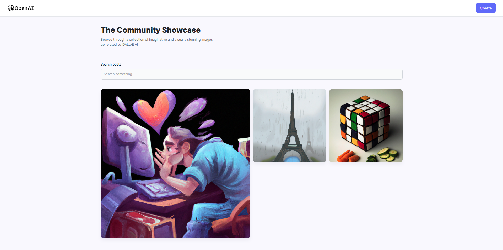
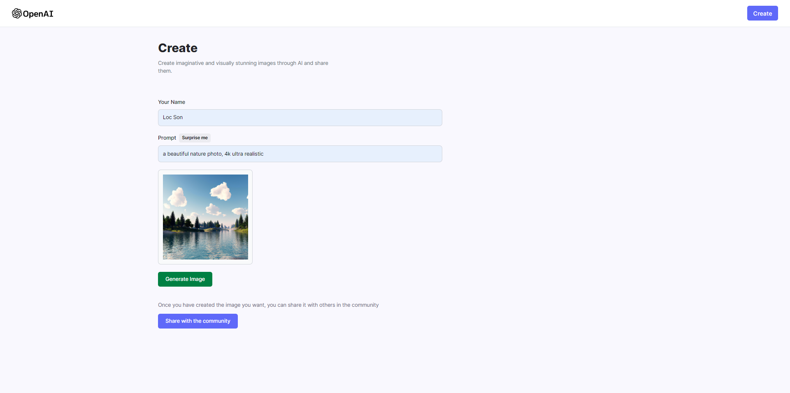

# Image AI generator



## Table of Contents

- [Introduction](#introduction)
- [Features](#features)
- [Installation](#installation)
- [Usage](#usage)

## Introdution
AI Image Generator is a web application built with ReactJS for the front-end and a simple Node.js Express API. The application utilizes the OpenAI API to generate images based on user-inputted text.

---
## Features
- Text-to-Image Generation: The AI Image Generator allows users to input text and generates corresponding images using the OpenAI language model. It leverages the power of AI to transform textual descriptions into visual representations.

- User-Friendly Interface: The web application provides a user-friendly interface where users can easily input their desired text and visualize the generated images. The responsive design ensures a seamless experience across different devices.

- Customizable Output: Users have the option to customize the output by adjusting parameters such as image size, color palette, or style. This allows for more control over the generated images to match specific requirements.

## Installation

1. Clone the repository
      ```bash
      git clone https://github.com/hualocson/AI-image-generator.git
      ```
2. Navigate to the server directory:
      ```bash
      cd AI-image-generator/server
      ```
3. Install the required dependencies for server:
      ```bash
      npm install
      ```

2. Navigate to the client directory:
      ```bash
      cd ../client
      ```
3. Install the required dependencies for client:
      ```bash
      npm install
      ```

---
## Usage

1. Make sure you have set up your OpenAI API key by setting the `OPENAI_API_KEY` environment variable.

2. Make sure you have set up your Cloudinary API key by setting the `CLOUDINARY_API_KEY` environment variable.

3. Run the script with the following command in both client and server folder:
   ```bash
   npm start
   ```

Open your web browser and visit http://localhost:3000 to access the Image AI generator website.